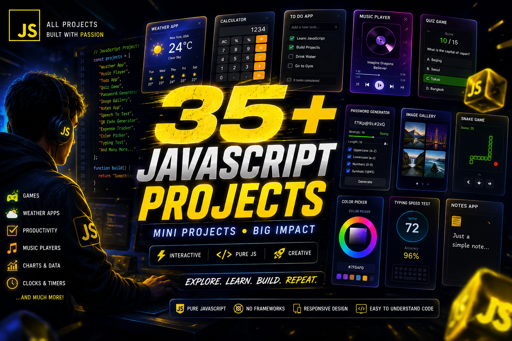

# 🚀 Swaroop Jadhav — Full-Stack Developer Portfolio

<div align="center">



[](https://swaroop-portfolio-rouge.vercel.app/)
[](https://github.com/Swappy514)
[](https://www.linkedin.com/in/swaroopjadhav514/)
[](https://swaroopdev.hashnode.dev/)

**A cinematic, high-performance personal portfolio built with Next.js 16, Tailwind CSS and Framer Motion.**

[View Live](https://swaroop-portfolio-rouge.vercel.app/) · [Report Bug](https://github.com/Swappy514/swaroop-portfolio/issues) · [Connect on LinkedIn](https://www.linkedin.com/in/swaroopjadhav514/)

</div>

---

## 📋 Table of Contents

- [About the Project](#about-the-project)
- [Features](#features)
- [Tech Stack](#tech-stack)
- [Sections](#sections)
- [Getting Started](#getting-started)
- [Environment Variables](#environment-variables)
- [Deployment](#deployment)
- [Project Structure](#project-structure)
- [Performance](#performance)
- [Contact](#contact)

---

## 🎯 About the Project

A world-class personal portfolio designed to stand out from template-based developer portfolios. Built with a cinematic dark aesthetic inspired by premium SaaS products, featuring smooth animations, real-time blog integration, and a fully functional contact system.

This portfolio was built completely from scratch — no templates, no UI kits — to demonstrate real full-stack development skills to recruiters and freelance clients.

**Why this portfolio is different:**
- Cinematic intro animation with iris wipe effect
- Orbiting tech icons around the hero section
- Dark to light section transitions
- Real Hashnode blog integration via GraphQL API
- Animated project cards with real project screenshots
- Fully functional contact form with Gmail integration
- Active section detection in navbar while scrolling
- Custom cursor with gradient trail

---

## ✨ Features

### Visual & Animation
- 🎬 Cinematic boot sequence intro animation
- 🌀 Orbiting tech icons with canvas particle background
- 💡 Custom orange-to-amber gradient design system
- 🖱️ Custom cursor with animated ring
- 📊 Scroll progress indicator
- ⬆️ Back to top button with smooth scroll
- 🎭 Framer Motion scroll-triggered entrance animations

### Functional
- 📧 Working contact form with Nodemailer and Gmail
- 📝 Auto-syncing blog from Hashnode GraphQL API
- 🔍 Blog sort by New, Old, Most Viewed, Most Liked
- 🏷️ Blog filter by tags
- 💼 Project filter by tech stack category
- 📱 Fully responsive across all screen sizes
- 🔗 Active section highlighting in navigation
- 📄 CV/Resume direct download

### Technical
- ⚡ Next.js App Router with Server Components
- 🎨 Tailwind CSS with custom design tokens
- 🔒 Environment variables for secure credential storage
- 🖼️ Next.js Image optimization
- 🔤 Next.js Font optimization with zero layout shift
- 📈 Vercel Speed Insights integration
- 🌐 SEO optimized with Open Graph metadata

---

## 🛠️ Tech Stack

### Frontend


### Backend & APIs


### Deployment & Tools


---

## 📄 Sections

| # | Section | Description |
|---|---------|-------------|
| 01 | **Hero** | Full-screen intro with orbiting tech icons and particle canvas |
| 02 | **About** | Dark profile card with social links, stats and bio |
| 03 | **Projects** | Bento grid with real screenshots, filters and GitHub links |
| 04 | **Skills** | Tabbed skill categories with proficiency indicators |
| 05 | **Hobbies** | Personal interests beyond coding |
| 06 | **Blog** | Live Hashnode blog integration with sort and filter |
| 07 | **Contact** | Working contact form with email delivery |

---

## 🚀 Getting Started

### Prerequisites

Make sure you have these installed:
```bash
node --version   # v18 or higher
npm --version    # v9 or higher
git --version    # any version
```

### Installation

1. Clone the repository
```bash
git clone https://github.com/Swappy514/swaroop-portfolio.git
```

2. Navigate to the project directory
```bash
cd swaroop-portfolio
```

3. Install dependencies
```bash
npm install
```

4. Create environment variables file
```bash
cp .env.example .env.local
```

5. Fill in your environment variables (see below)

6. Run the development server
```bash
npm run dev
```

7. Open your browser at `http://localhost:3000`

---

## 🔐 Environment Variables

Create a `.env.local` file in the root directory with these values:

```env
EMAIL_USER=your.gmail@gmail.com
EMAIL_PASS=your_gmail_app_password
```

**To get your Gmail App Password:**
1. Go to myaccount.google.com
2. Security → 2-Step Verification → enable it
3. Security → App passwords
4. Type a name like "Portfolio" → Create
5. Copy the 16-character password → paste as EMAIL_PASS

> ⚠️ Never commit your `.env.local` file. It is already listed in `.gitignore`.

---

## 📦 Deployment

This project is deployed on **Vercel** with automatic deployments on every push to main.

### Deploy Your Own

1. Fork this repository
2. Go to [vercel.com](https://vercel.com) and import your fork
3. Add environment variables in Vercel dashboard:
   - `EMAIL_USER`
   - `EMAIL_PASS`
4. Click Deploy

[](https://vercel.com/new/clone?repository-url=https://github.com/Swappy514/swaroop-portfolio)

### Update After Changes

Every push to GitHub automatically redeploys:
```bash
git add .
git commit -m "your update"
git push
```

---

## 📁 Project Structure

```
swaroop-portfolio/
├── app/                          # Next.js App Router
│   ├── layout.tsx                # Root layout with fonts and metadata
│   ├── page.tsx                  # Home page
│   ├── globals.css               # Global styles and design tokens
│   ├── blog/
│   │   ├── page.tsx              # Blog listing with sort and filter
│   │   └── [slug]/page.tsx       # Individual blog post redirect
│   └── api/
│       ├── contact/route.ts      # Contact form email API
│       └── hashnode/route.ts     # Hashnode blog API proxy
│
├── components/                   # React components
│   ├── Navbar.tsx                # Navigation with active section detection
│   ├── Hero.tsx                  # Hero with orbit animation and particles
│   ├── About.tsx                 # Profile card and bio section
│   ├── Projects.tsx              # Project bento grid with filters
│   ├── Skills.tsx                # Tabbed skills with proficiency bars
│   ├── Hobbies.tsx               # Interest cards
│   ├── Blog.tsx                  # Hashnode blog preview cards
│   ├── Contact.tsx               # Contact form with email integration
│   ├── Footer.tsx                # Site footer
│   ├── Intro.tsx                 # Boot animation overlay
│   ├── CustomCursor.tsx          # Custom cursor with ring
│   ├── ScrollProgress.tsx        # Top scroll progress bar
│   ├── BackToTop.tsx             # Back to top floating button
│   └── BlogNavbar.tsx            # Blog pages navigation
│
├── content/                      # MDX blog post files
├── lib/
│   ├── hashnode.ts               # Hashnode GraphQL API client
│   └── mdx.ts                    # MDX blog post reader
│
├── public/
│   └── projects/                 # Project screenshots and resume PDF
│
├── next.config.ts                # Next.js configuration
├── tailwind.config.ts            # Tailwind CSS configuration
└── .env.example                  # Environment variables template
```

---

## ⚡ Performance

Built with performance in mind:

- **Next.js Image** — automatic image optimization and lazy loading
- **next/font** — zero layout shift font loading
- **Server Components** — reduced client-side JavaScript
- **Static Generation** — blog pages pre-rendered at build time
- **Vercel Edge Network** — global CDN for fast delivery worldwide

---

## 🐛 Known Issues

- Hashnode API may be blocked on certain local networks in India. The portfolio shows a fallback post locally but fetches real posts correctly on Vercel production deployment.

---

## 📬 Contact

**Swaroop Jadhav** — Full-Stack Developer

- 🌐 Portfolio: [swaroop-portfolio-rouge.vercel.app](https://swaroop-portfolio-rouge.vercel.app/)
- 💼 LinkedIn: [linkedin.com/in/swaroopjadhav514](https://www.linkedin.com/in/swaroopjadhav514/)
- 🐙 GitHub: [github.com/Swappy514](https://github.com/Swappy514)
- 📝 Blog: [swaroopdev.hashnode.dev](https://swaroopdev.hashnode.dev/)
- 📧 Email: swaroopjadhav5@gmail.com

---

## 📜 License

This project is open source and available under the [MIT License](LICENSE).

Feel free to use this as inspiration for your own portfolio. If you do, a star ⭐ on this repo would be appreciated!

---

<div align="center">

**Built with ❤️ and JavaScript by Swaroop Jadhav**

*BTech CSE 2025 · Full-Stack Developer · Maharashtra, India*

⭐ Star this repo if you found it helpful!

</div>
